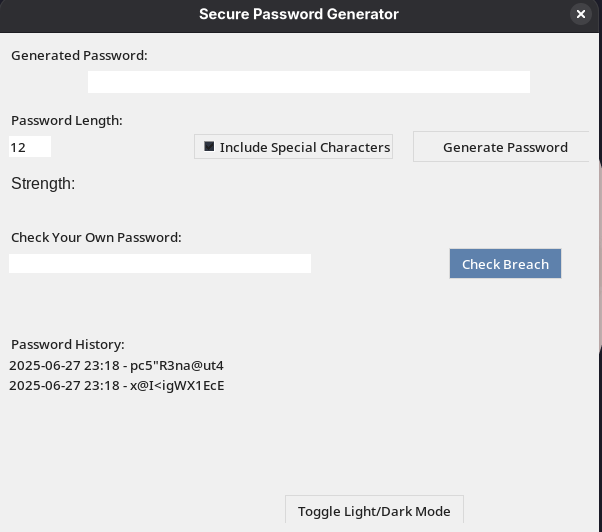
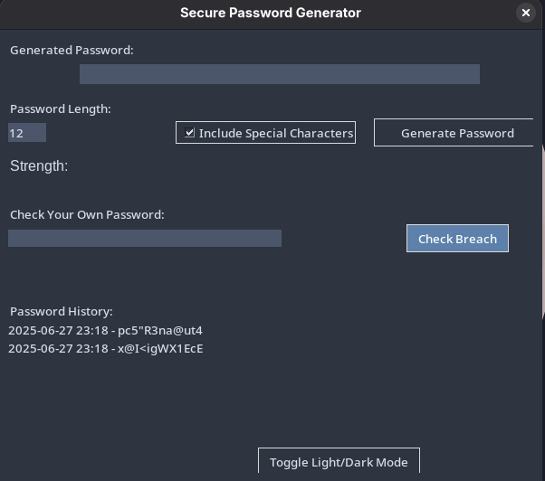
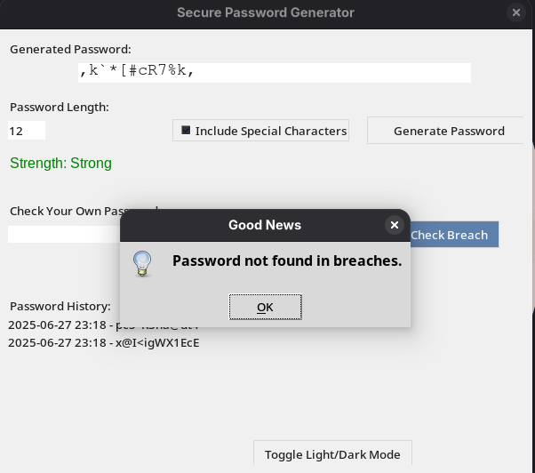

# Secure Password Generator with Breach Checker

A feature-rich Python desktop application built with Tkinter for generating secure passwords, checking if they have been exposed in known data breaches, and managing password history securely.

---

## Features

- **Generate Secure Passwords**  
  Customize length and inclusion of special characters.

- **Password Breach Checking**  
  Checks passwords against the [Have I Been Pwned](https://haveibeenpwned.com/API/v3#PwnedPasswords) database to see if they have appeared in known breaches.

- **Password Strength Indicator**  
  Visual feedback on password strength (Weak / Medium / Strong).

- **Copy to Clipboard**  
  Quickly copy generated passwords for use.

- **Custom Password Breach Check**  
  Check any password you input manually for breach status.

- **Password History with Encryption**  
  Keeps a local encrypted history of generated passwords for reference.

- **Light / Dark Theme Toggle**  
  Switch between light and dark UI themes for comfortable use.

- **Password Expiry Reminder**  
  Notifies if a generated password is older than 30 days.

---

## Requirements

- Python 3.6+  
- Modules:  
  - `tkinter` (usually included with Python)  
  - `requests`  
  - `cryptography`

---

## Installation

1. Clone or download this repository.

2. Install required Python packages:

   ```bash
   pip install requests cryptography
   ```

3. Run the application:

   ```bash
   python secure_passgen_full.py
   ```

---

## Usage

- Enter desired password length and whether to include special characters.  
- Click **Generate Password** to create a secure password.  
- View password strength and breach status notifications.  
- Use **Copy Password** to copy it to your clipboard.  
- Check any custom password in the "Check Your Own Password" field.  
- View your password history in the list and clear it if desired.  
- Toggle between light and dark themes using the button.  
- The app reminds you if your password is older than 30 days.

---

## Security Notes

- Password history is encrypted locally using symmetric encryption (`cryptography` library).  
- No passwords or data are sent externally except to the Have I Been Pwned API for breach checking.  
- Use this tool responsibly and avoid sharing sensitive passwords unnecessarily.

---

## Screenshots

### Light Mode



### Dark Mode



### Breach Screen



---

## Contact

For questions, feedback, or feature requests:  
**Developer:** [r4ttles]  
**GitHub:** [https://github.com/r4ttles]

---

Enjoy safer passwords!
